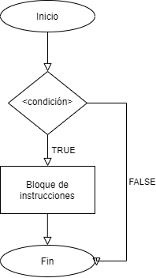
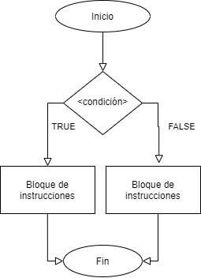

```{r setup, include=FALSE}
knitr::opts_chunk$set(echo = TRUE)
```

# Ciclos

*R* posee una gran ventaja respecto a otros lenguajes de programación, devido a que se puede programar de manera sencilla una serie de análisis que se ejecuten de manera sucesiva, a este tipo de estructuras se les conoce como *estructuras de control* las cuales se describiran a continuación:

## IF

El comando *IF* ("si" condicional en inglés) permite evaluar una expresión y sobre el resultado (VERDADERO o FALSO) ejecutar un bloque de instrucciones.

Su estructura es la siguiente:

		if(<condicion>){
			Bloque de código
		}

En el siguiente diagrama de flujo se muestra como opera la función *IF*:

{#id .class width=50% height=30%}

para ver como funciona la función *IF* podemos ejecutar las siguientes lineas de código:

```{r if_true}
if (TRUE){
  print("Es verdadero, ¡se ejecuta el bloque de código!")
}
```

```{r if_false}
if (FALSE){
  print("Es falso, ¡no se ejecuta la instrucción!")
}

```
Darle valores de TRUE o FALSE directamente a una funcion *IF* es poco común, lo que usualmente se hace es pasarle una expresión y esta al ser evaluada retorna un TRUE o FALSE, como lo veremos en el siguiente ejemplo, donde se generara un número aleatorio entre 0 y 1 y se evaluara:

```{r if_eval}
x <- runif(1)
if (x > 0.5){
  print("Este mensaje tiene un 50% de probabilidades de ser mostrado")
  print(x)
}
```

## ELSE

El comando *ELSE* es un complemento de la función *IF* la cual funciona de la siguiente manera, al evaluarse la función y dar un resultado FALSE ejecutara un bloque de instrucciones, dicho comportamiento lo podemos ver en el siguiente diagrama de flujo:

{#id .class width=50% height=30%}