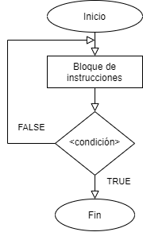
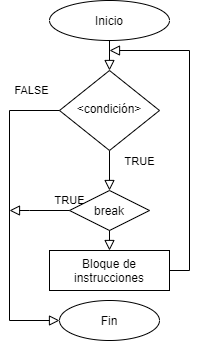
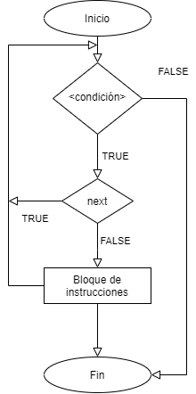

```{r setup, include=FALSE}
knitr::opts_chunk$set(echo = TRUE)
```

# Ciclos

*R* posee una gran ventaja respecto a otros lenguajes de programación, devido a que se puede programar de manera sencilla una serie de análisis que se ejecuten de manera sucesiva, a este tipo de estructuras se les conoce como *estructuras de control* las cuales se describiran a continuación:

## IF

El comando *IF* ("si" condicional en inglés) permite evaluar una expresión y sobre el resultado (VERDADERO o FALSO) ejecutar un bloque de instrucciones.

Su estructura es la siguiente:

		if(<condicion>){
			Bloque de código
		}

En el siguiente diagrama de flujo se muestra como opera la función *IF*:

{#id .class width=50% height=30%}

para ver como funciona la función *IF* podemos ejecutar las siguientes lineas de código:

```{r if_true}
if (TRUE){
  print("Es verdadero, ¡se ejecuta el bloque de código!")
}
```

```{r if_false}
if (FALSE){
  print("Es falso, ¡no se ejecuta la instrucción!")
}

```
Darle valores de TRUE o FALSE directamente a una funcion *IF* es poco común, lo que usualmente se hace es pasarle una expresión y esta al ser evaluada retorna un TRUE o FALSE, como lo veremos en el siguiente ejemplo, donde se generara un número aleatorio entre 0 y 1 y se evaluara:

```{r if_eval}
x <- runif(1)
if (x > 0.5){
  print("Este mensaje tiene un 50% de probabilidades de ser mostrado")
  print(x)
}
```

## ELSE

El comando *ELSE* es un complemento de la función *IF* la cual funciona de la siguiente manera, al evaluarse la función y dar un resultado FALSE ejecutara un bloque de instrucciones, dicho comportamiento lo podemos ver en el siguiente diagrama de flujo:

{#id .class width=50% height=30%}

El código después de un *else* se ejecutara solo si el resultado de la condición en *if* es FALSE, podemos ver su estructura de la siguiente manera: 

    if(<condicion>){
      Bloque de código
    }else {
      Bloque de código
    }

Su ejecución seria de la siguiente manera:

```{r ifelse_eval}
x <- runif(1)
if (x > 0.5){
  cat(c(x, ">", "0.5"))
}else{
  cat(c(x, "<", "0.5"))
}
```

Las estructuras de control lógicas *If* y *If-else* permiten tener mas estructuras de control dentro de si mismas dentro de los bloques de código, a esto se le llama *anidación".


## FOR

El bucle *FOR* es una estructura iterativa que se ejecuta un número de veces preestablecido, controlado por un contador. En el siguiente Diagrama podemos ver el funcionamiento de este ciclo.

 {#id .class width=50% height=30%}

 Su estructura es la siguiente:

    for(<contador> in <secuencia>){
      Bloque de código
    }

Algunos ejemplos serian los siguientes:

```{r for_sample0}
for (i in 1:5){
  print(i)
}
```
```{r for_sample1}
suma <- 0
for (i in 1:5){
  suma <- suma + i
}
suma
```

```{r for_sample2}
# Vector aleatorio
x <- sample(1:50, 100, replace=TRUE)
# inicializo la variable suma
suma <- 0
# bucle for para calcular la media
for (i in seq_along(x)){
  suma <- x[i] + suma
  media <- suma/length(x)
}
media
```

Con el ejemplo anterior podemos mejorarlo introduciendo un ciclo condicional para ver un ejemplo de anidación.

```{r for_sample3}
# Vector aleatorio
x <- sample(1:50, 100, replace=TRUE)
# inicializo la variable suma
suma <- 0
# bucle for para calcular la media
for (i in seq_along(x)){
  suma <- x[i] + suma
  if(i == length(x) ){
    media <- suma/length(x)
  }
}
media
```

##  WHILE

El bucle *while* se utiliza principalmente cuando no se sabe el número de itraciones, este bucle se ejecutara mientras se cumple una condición que se comprueba al principio de la instrucción. El diagrama de flujo muestra su operación.

 {#id .class width=50% height=30%} 

Su estructura del bucle *while* se muestra a continuación:

    while(<condición>){
      Bloque de código
    }

Un ejemplo de ello serian los siguientes:

```{r while_sample0}
n <- 1
while (n <= 5 ){
  print(n)
  n <- n +1
}
```

```{r while_sample1}
n <- 1
while (n < 50 ){
  n <- n *2 + (n+2)
  print(n)
}
```

## REPEAT

El bucle *repeat* es muy similiar a *while* excepto que el bloque de instrucciones es ejecutado por lo menos una vez, sin importar el resultado de la condición.

En el diagrama de flujo vemos su operación.

 {#id .class width=50% height=30%} 

Un ejemplo de ejecución seria el siguiente:


```{r repeat_sample0}
n <- 1
repeat {
  if(n <= 5){
    print(n)
    n <- n +1 
  }else{
    break
  }
}
```

Para deter el ciclo *repeat* es necesario establecer una condición para el comando *break*, este comando se utiliza para salir de los bucles infinitos. 

## BREAK

El comando *break* puede ser utilizado por los ciclos *for*, *while* y *repeat*, su ejecución finaliza el bucle mas proximo en el que se encuentre. El diagrama de flujo muestra su ejecución:

{#id .class width=50% height=30%} 

Un ejemplo de ejecución seria el siguiente:

```{r break_sample0}
# creamos una matriz de 5*5
m <-  matrix(1:25,5,5)
m

#cambiamos a 0 todos los números pares
for(i in 1:nrow(m)){
  for(j in 1:ncol(m)){
    if(m[i,j]%%2 == 0){
      if(m[i,j] >= 20){
        break
      }
      m[i,j] <- 0
    }
  } 
}
# imprimimos la nueva matriz
m
```

## NEXT

La clausula *next* interrumpe una iteración y salta al siguiente ciclo, en pocas palabras, puede dar por terminado un ciclo.

El diagrama de su funcionamiento es el siguiente:

{#id .class width=50% height=30%} 

Un ejemplo claro seria el siguiente, imprimir los números pares de una secuencia:

```{r next_sample}
for(i in 1:10){
  if(i%%2)next
  print(i)
}
```
